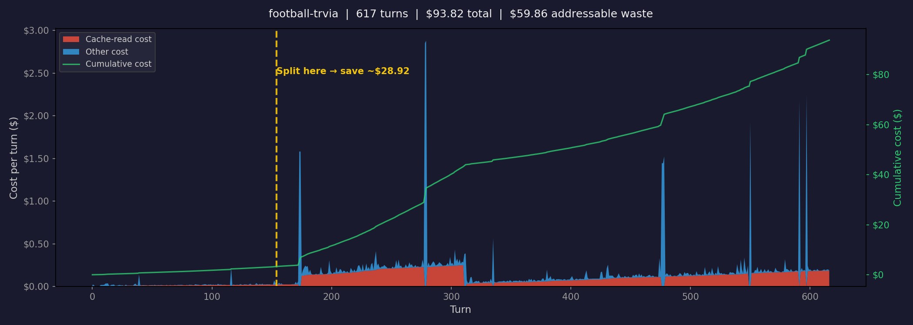

# ccburn

**ccusage tells you the bill. ccburn tells you why.**

A local-only CLI that reads your Claude Code session logs and explains where the money went — cache-read burn from marathon sessions, Opus spend on Sonnet-grade work, doom loops, redundant file re-reads. Every dollar of claimed waste points at specific turns you can audit.



*A real 617-turn session: $93.82 at API-equivalent rates. $60 of that was cache reads — the cost of Claude re-reading an ever-growing conversation every turn. Splitting at turn 154 would have saved ~$29.*

## The problem

Existing tools ([ccusage](https://github.com/ryoppippi/ccusage), ccost, ccflare, etc.) answer **"how much did I spend?"** — tables of tokens and dollars by day or session.

Nobody answers **"why was it expensive and what should I change?"**

ccburn does. It runs four detectors on your local session logs:

| Detector | What it finds | Example |
|----------|--------------|---------|
| **Cache-read burn** | Long sessions where cache reads dominate cost; suggests where to split | "64% of this session's cost was cache reads. Split at turn 154 → save ~$29" |
| **Model-mix waste** | Opus turns that only did simple tool work (Read, Glob, Bash, Edit) | "214 turns used Opus for file reads. At Sonnet rates, that's $31 saved" |
| **Redundant reads** | Same file read 3+ times with no edit in between | "handler.py read 4x — Claude lost track of context" |
| **Doom loops** | Runs of 3+ near-identical tool calls | "Edit on compute-construct.ts repeated 11x" |

All heuristics. All deterministic. Milliseconds to run. No LLM calls. Nothing leaves your machine.

## Install

```bash
pip install ccburn
```

Or from source:

```bash
git clone https://github.com/yasharora/ccburn.git
cd ccburn
pip install .
```

## Usage

### Scan all sessions

```
$ ccburn scan
```

Shows every session ranked by cost, with cache-read percentage, addressable waste, and the dominant waste pattern. Ends with a summary:

```
TOTAL ESTIMATED COST:  $305.67
TOTAL ESTIMATED WASTE: $177.15
Worst offender: football-trvia ($93.82, 617 turns)
```

Filter to a project:

```
$ ccburn scan --project football
```

### Deep dive into a session

```
$ ccburn session 0
```

Use the index from `scan` output or a session ID prefix. Shows token breakdown, all detector findings with evidence turn numbers, and per-file details.

### Generate a burn chart

```
$ ccburn chart 0
```

Writes a PNG with:
- **Stacked area**: cache-read cost (red) vs other cost (blue) per turn
- **Cumulative line**: total spend over the session
- **Split point**: dashed line where splitting the session would save the most

## How it works

Claude Code writes a JSONL log for every session to `~/.claude/projects/`. Each assistant turn includes token usage (input, output, cache writes, cache reads) and tool calls. ccburn:

1. **Parses** every JSONL file into typed session/turn objects
2. **Prices** each turn at API-equivalent rates (Opus $15/$75 per MTok in/out, Sonnet $3/$15, with cache pricing)
3. **Runs detectors** that flag waste patterns and attribute dollar amounts to specific turns
4. **Renders** tables (Rich) and charts (matplotlib)

Costs are estimates. Pro/Max plan users pay a flat rate — ccburn shows what the same usage would cost at API rates, so you can see relative waste even without a real bill.

## Why these detectors?

Built from a survey of 21 real sessions ($305 total). The data picked the features:

| Detector | Dollars found | Sessions hit |
|----------|--------------|-------------|
| Model-mix waste | $98 | 15 |
| Cache-read burn | $78 | 13 |
| Doom loops | — | 10 |
| Redundant reads | — | 3 |

Cache-read burn and model-mix waste account for essentially all quantifiable waste. The others are diagnostic signals — they tell you something went wrong even if the dollar amount is hard to pin down.

## Prior art

- [ccusage](https://github.com/ryoppippi/ccusage) — CLI tables of cost by day/session/project. Most popular in the space. Great for the bill, no waste analysis.
- [claude-token-analyzer](https://github.com/anthropics/claude-token-analyzer) — Statistical anomaly detection (6 types), severity scoring, SQLite. Closest neighbor — but flags anomalies without behavioral explanation or dollar attribution.
- ccost, ccflare, Claude-Code-Usage-Monitor, CCTracker — Various UIs on the same JSONL data, all answering "how much."

ccburn is the explanation layer: not just *what* you spent, but *why*, and *what to do differently*.

## License

MIT
